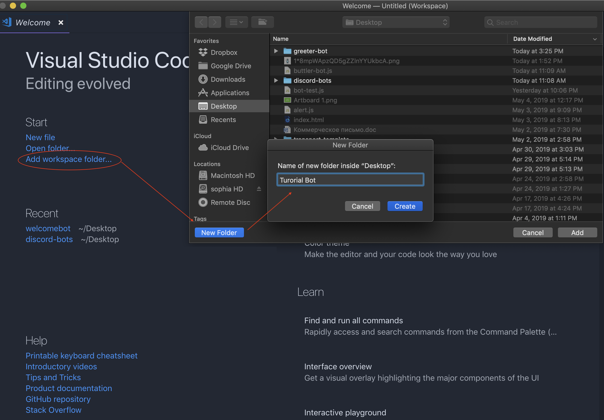

# Discord Bot Tutorial (in Russian language)

[](https://opensource.org/licenses/MIT) [](https://GitHub.com/Naereen/StrapDown.js/graphs/contributors/) [](https://github.com/ellerbrock/open-source-badges/) [](https://saythanks.io/to/kennethreitz)

[](https://GitHub.com/Naereen/)


## Создание Discord бота

### **Вам понадобятся**:

- Редактор кода > [Visual Studio Code](https://code.visualstudio.com/)<br />
- [Node JS](https://nodejs.org/en/)<br />
- Библиотека Discord.js

### **Документация**

- [Discord.js Guide](https://discordjs.guide/)
- [Discord.js](https://discord.js.org/#/)

1) Открываете редактор кода (VSCode) и через **"Add workspace folder"** создаете папку для проекта.



2) Открываете терминал в редакторе **> Terminal > New Terminal и вводите команду:**

```npm init``` 


в конце на вопрос **Is this OK? (yes) >** набираете команду **yes** 

В рабочей папке появится файл **> package.json**

Открываете его в редакторе и в **"description"** прописываете описание вашего бота и по желанию в графе **"author"** (автор) свои инициалы. Сохраняете через шорткаты: 

```CMD + S``` для **Mac OS**  

```CTRL + S``` для **Windows**.


3) Возвращаетесь в терминал и подключаете модуль Discord через **команду:**
                     
```npm install discord.js --save``` 


4) Переходите в файл **index.js** и прописываете следующий код: 

```const Discord = require("discord.js");```

```const client = new Discord.Client();```

**NB:** Вместо **"Discord"** и **"client"** можно подставить свои названия.

5) Переходите на сайт [Discord Developer Portal](https://discordapp.com/developers/applications/) для регистрации бота в своем Discord через функцию **"New Application"**


6) Далее копируете ```TOKEN``` своего бота (предварительно создав его через функцию **"Add bot"**) и переходите в редактор кода, дописывая следующую строку в файл ```auth.json```:

```json
{
    "token": "" // Place your bot TOKEN here
}
```

7) Переходите в файл ```index.js``` и подключаете ваш ```auth.json``` файл:

```const auth = require('./auth.json');```


8) Для добавления бота на сервер, переходите в раздел **"General Information"** и копируете **Client ID**.


9) Далее переходите на страницу **Discord > Permissions Calculator**, тикаете все боксы, а в нижней графе **Client ID** вставляете скопированный **ID-номер**. Далее переходите по ссылке для авторизации и добавления бота на ваш сервер. 


10) Прописываете приветсвенную команду для вашего бота в файле **index.js:** 

**Примечание:** Данный бот поприветствует нового участника сервера и задаст некоторые вопросы (вы можете указать любые другие соответственно):

```javascript

client.on('message', message => {
    if (message.type === 'GUILD_MEMBER_JOIN') {
        const user = message.author.username;
        const discriminator = message.author.discriminator;
        message.channel.send(`** Добро пожаловать, @${user}! :raising_hand:**
** Расскажи нам немного о себе: **
:zero: Как тебя зовут?
:one: Чем занимаешься [учишься/работаешь]?
`);
    }
});
```

11) Запускаете бота через терминал командой: <br /><br />
```node .```


11) Для развертывания вашего приложения, вы можете воспользоваться бесплатным Paas-сервисом ```Heroku``` или ```Glitch``` , тогда ваш бот будет доступен 24/7.